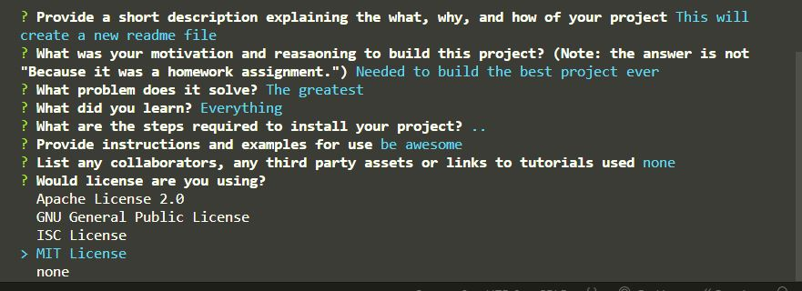

# README Generator (using nodeJS)


## Description

A README generator made using [nodeJS](https://nodejs.org/en/docs/), [InquirerJS](https://www.npmjs.com/package/inquirer) and [Badge-maker](https://www.npmjs.com/package/badge-maker). By answering a series of prompts in the terminal, a new README file is created and can easily be copied into any project needing a README. Just remember to review the file for spelling errors or spacing issues. Answering prompts in the terminal doesn't always lead to a clean looking page. You can also freely add images and links once the README file is generated.

An svg file is also created, so that you can include license badges in your projects as well.



### My motivations

Writing and filling out README's for projects can be hard, long and tedious. This code helps to simplify the process and is reusable for any future project. Structure of the README is based on this guide found [here](https://coding-boot-camp.github.io/full-stack/github/professional-readme-guide)

### What problem does it solve?

It saves time and mental energy in writing up interesting README's for code projects.

### What I learned

I learned that it's possible to run JavaScript in a browserless setting, and that it is still capable of doing amazing things.

First time experimenting with nodeJS and other modules. It was tricky getting used to running JavaScript in the terminal, but a good learning experience. Worked with new syntax and read through documentations for FS modules, inquirer, and badge-maker.

## Preview

[video link to preview project](https://drive.google.com/file/d/1Z7jmgpR3Ph7ux4GzcD3ohSYlfGt8QgLv/view?usp=share_link)

## Table of Contents

- [Installation](#installation)
- [Usage](#usage)
- [Credits](#credits)
- [License](#license)
- [Questions](#questions)

## Installation

1. Download the code to your own local machine and open up in a terminal of your choice (like VS code).

2. Open terminal, and run

```
npm install
```

3. Once all the missing node packages are installed, you're good to go.

```
NOTE: If nodeJS is not installed on your machine, download at nodejs.org
```

## Usage

Once project is downloaded and the node_modules folder is downloaded, you are ready to begin.

Run the command

```
node index.js
```

Then simply answer all the questions in your terminal, until the file is created. Afterwards, you can freely edit your file before copying it and the svg into another project.

## Credits

- [InquirerJS](https://www.npmjs.com/package/inquirer)
- [Badge-maker](https://www.npmjs.com/package/badge-maker)
- [Professional README Guide](https://coding-boot-camp.github.io/full-stack/github/professional-readme-guide)

## License

[](https://choosealicense.com/licenses/mit/)

For more information about the licensing of this project, please click on the badge above, or follow this link https://choosealicense.com/licenses/mit/

## How to Contribute

Fork, submit pull requests and star the project!

## Tests

## Questions

How to get into contact with me?

[My Github Profile](https://github.com/Jon-Ledo)

Email : jonledo.code@gmail.com
