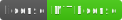

  # Sample-README
  

  ## Description
  This will be a short README file, to demonstrate what the generated outcome should look like

  ### My motivations
  test

  ### What problem does it solve?
  test

  ### What I learned
  test

  ## Preview 
  <!-- include a preview image for your readers -->
  

  ## Table of Contents
  - [Installation](#installation)
  - [Usage](#usage)
  - [Credits](#credits)
  - [License](#license)
  - [Questions](#questions)

  ## Installation
  npm install

  ## Usage
  node index.js

  ## Credits
  test

  ## License
  
  

  For more information about the licensing of this project, please click on the badge above, or follow this link https://choosealicense.com/licenses/mit/
  

  ## How to Contribute
  star comment subscribe

  ## Tests
  none at this time

  ## Questions
  How to get into contact with me?
  
  [My Github Profile](https://github.com/Jon-Ledo)

  Email : fake@gmail.com

